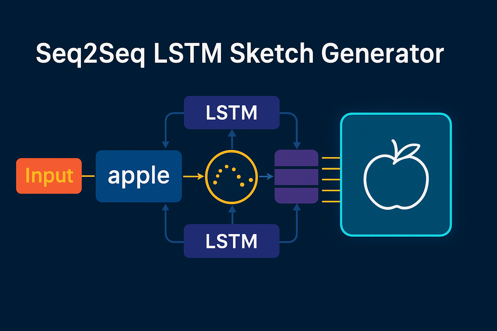
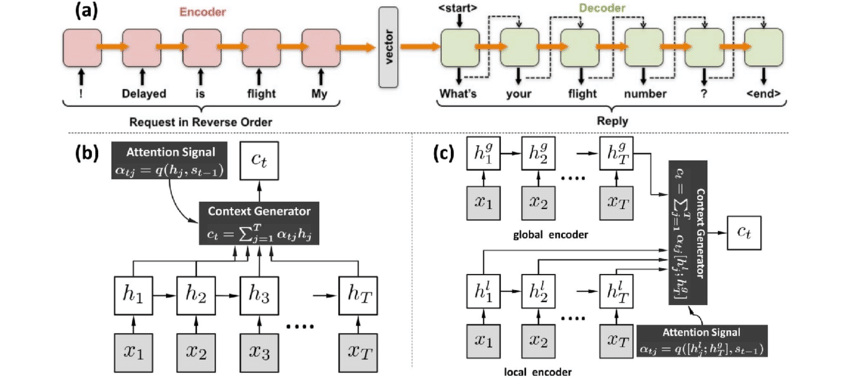
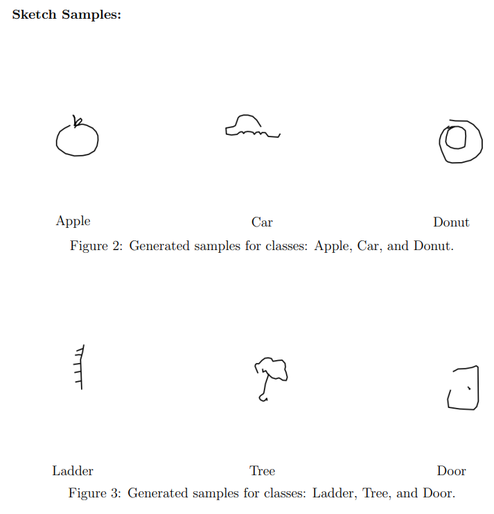
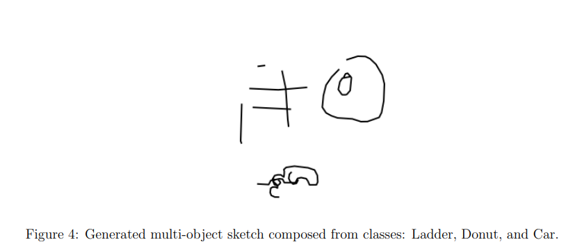

<h1 align="center"> Sketch Generation from Class Name using Seq2Seq with Attention</h1>

<p align="center">
  
</p>

---


## Overview

This project implements a sequential generative model in PyTorch to create human-like sketches from class names using the Quick, Draw! dataset. The model mimics the way humans draw — one stroke at a time — and supports real-time visualization of stroke generation.

We used a sequence-to-sequence (Seq2Seq) architecture with LSTM encoder-decoder and attention mechanism, conditioned on object class names. This project also includes bonus functionalities such as interactive refinement and multi-object scene generation.

---

## Dataset

### Source

The dataset used is [Quick, Draw!](https://quickdraw.withgoogle.com/data), which provides millions of stroke-based sketches collected from users worldwide.

Each file contains stroke sequences in `.ndjson` format, where:
- Each sketch is a list of strokes.
- Each stroke is a list of x and y coordinates.
- Each drawing is annotated with a class name and a `recognized` flag.

### Selected Categories

Ten distinct categories were used for training and testing:
- `apple`, `car`, `donut`, `ladder`, `tree`, `door`, `baseball`, `pizza`, `hexagon`, `circle`

### Preprocessing Steps

1. **Filtering**: Only drawings marked as `recognized` were selected.
2. **Pen-State Conversion**: Each point is converted to (x, y, pen_state), where:
   - 1: pen down
   - 0: pen up (end of a stroke)
   - 2: end of drawing
3. **Normalization**:
   - Coordinates were centered and scaled to fit in a [-1, 1] range.
4. **Delta Conversion**:
   - Absolute (x, y) points were converted to (Δx, Δy) to capture drawing movement.
5. **Padding**:
   - Drawings were padded or truncated to a fixed length of 250 points.
6. **Pen-State One-Hot Encoding**:
   - Pen state was encoded as a 3-length one-hot vector: [1, 0, 0], etc.

---

## Model Architecture

The model is a conditional Seq2Seq generator with attention.

### Encoder

- Takes stroke sequence and class label as input.
- Class label is embedded and concatenated with stroke vectors.
- A two-layer LSTM encodes the sequence.
- Layer normalization is applied to the encoder outputs.

### Attention

- A dot-product attention mechanism allows the decoder to focus on relevant encoder states at each decoding step.

### Decoder

- Takes the previous output, attention context, and class embedding as input.
- First hidden and cell states are initialized from the class embedding.
- Uses a two-layer LSTM followed by a linear layer to predict:
  - Δx, Δy (coordinates)
  - Pen state (softmax over 3 classes)

---

## Training Procedure

- **Input**: (X) stroke sequences (excluding last point)
- **Target**: (Y) stroke sequences (excluding first point)
- **Loss**:
  - MSE for (Δx, Δy)
  - Cross-entropy for pen state
- **Optimization**: AdamW with ReduceLROnPlateau scheduler
- **Early Stopping**: Stops if validation loss does not improve for 10 epochs
- **Teacher Forcing**:
  - Used with decaying probability across epochs

---

## Data Split

- 70% Training
- 15% Validation
- 15% Test

---

## Visualization

### Real-Time Stroke Animation

- Animated using `matplotlib` with per-stroke updates.
- Colors change between strokes for clarity.

### Static Image Saving

- Generated and saved as `.png` files.

---

## Inference

### Sketch Generation

- Start with a zero vector and pen down state.
- At each step:
  - Predict (Δx, Δy) and pen state.
  - Update input for next step.
- Stop when pen state = 2 (end of drawing)

### Scene Generation (Bonus 2)

- Multiple objects are drawn in the same canvas using predefined offsets.
- Ensures no pen_state = 2 occurs between objects.
- Produces a coherent scene with distinct objects.

---

## Bonus Features

### Interactive Refinement (Bonus 1)

- Allows user-edited sketches (e.g., in Paint) to be converted to stroke sequences using OpenCV.
- These strokes are converted to deltas and fine-tuned into the model using a few training steps.

---

## Directory Structure

```
.
├── *.ndjson                  # Stroke data files for each class
├── Code.py                   # Main training + generation script
├── model_architecture1.png   # Seq2Seq architecture with LSTM encoder-decoder and attention module
├── sketch.png                # Output from sketch generation
├── multi_object_scene.png    # Output from scene generation
├── Seq2Seq_LSTM_Banner.png       # Banner image

```

---

## Dependencies

- Python 3.7+
- PyTorch
- NumPy
- Matplotlib
- OpenCV
- tqdm
- ndjson
- scikit-learn

---

## How to Run

1. Place `.ndjson` stroke files in the same directory.
2. Run the Python script to:
   - Load data and preprocess
   - Train the Seq2Seq model
   - Save the best model checkpoint
   - Generate and visualize sketches

---

## Results

- Model successfully generates human-like sketches for all 10 classes.
- Real-time generation closely mimics how humans draw strokes.
- Scene generation demonstrates compositionality.
- Interactive refinement improves drawing quality with minimal effort.

---

## Visual Examples

### Model Architecture



*Figure: illustrates the conditional Seq2Seq architecture with LSTM encoder-decoder and attention module. Class embeddings are injected at both encoder input and decoder initialization.*


### Sample Sketches (Single Class)



*Figure: Generated sketches for classes Apple, Car, Donut, Ladder, Tree, and Door.*

### Multi-Object Scene



*Figure: Generated multi-object scene composed of Ladder, Donut, and Car.*

---


## Authors

- Jyotishman Das
M.Tech Artificial Intelligence – IIT Jodhpur  
- [Portfolio](https://my-portfolio-jyotishman-das-projects.vercel.app)  
- [LinkedIn](https://www.linkedin.com/in/jyotishmandas85p/)
  
---

## License

This project is for academic use only.
